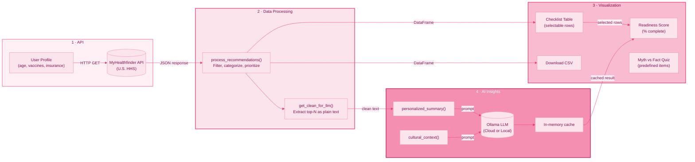

# ForHer / PCOSense + Zena

## PCOSense (default `app.py`)

**PCOSense: Multi-Agent System for Polycystic Ovary Syndrome Detection** — main Shiny UI in [`src/app/pcosense_app.py`](src/app/pcosense_app.py). Run **`shiny run app.py`**. Features: patient form → **Data Validator → Evidence Retriever (Chroma RAG + PubMed) → Risk Assessor (XGBoost + SHAP + NHANES + LLM)**; snapshot stats, **SHAP chart**, agent/tool/RAG transparency panels, raw JSON. Use **FastAPI** (`uvicorn src.api.main:app`) or **Run in-process** when `PCOSOrchestrator` is available.

## Zena (course app — `src/app/zena_app.py`)

**Healthcare in the U.S. explained without the confusion.** Zena is an interactive Shiny app for first-generation and international female students. It uses the **MyHealthfinder API** and Ollama for preventive-care guidance. Run: **`shiny run src/app/zena_app.py`**.

## Features

- **User inputs**: Age (16–60), country background, vaccination status (HPV, Tdap, Flu, MMR), insurance
- **Data processing**: Rule-based filtering, categorization (Vaccinations, Screenings, Preventive Visits, Lifestyle), priority assignment
- **Ollama integration**: Personalized summary, cultural context, Myth vs Fact (cached for efficiency)
- **Pink theme UI**: Flip cards, preventive readiness score, downloadable checklist

## Project Overview

| | |
|---|---|
| **Topic** | Women's Health for First-Gen / International Students |
| **API** | [MyHealthfinder API](https://odphp.health.gov/our-work/national-health-initiatives/health-literacy/consumer-health-content/free-web-content/apis-developers/api-content) (U.S. HHS) |
| **Stack** | Python, Shiny for Python, pandas, matplotlib |

## Quick Start

```bash
# 1. Create venv and install
python -m venv venv
source venv/bin/activate   # Windows: venv\Scripts\activate
pip install -r requirements.txt

# 2. Copy .env.example to .env and add your OLLAMA_API_KEY (or use local Ollama)
cp .env.example .env

# 3. Run PCOSense (default)
shiny run --reload app.py

# Optional: Zena course app
# shiny run --reload src/app/zena_app.py
```

## App V2 (Zena course rubric)

Zena V2 (`src/app/zena_app.py`) adds **MyHealthfinder** tool calling, **SQLite RAG**, matplotlib analytics, and optional **`ZENA_APP_PASSWORD`**. Docs: [`docs/APP_V2_DOCUMENTATION.md`](docs/APP_V2_DOCUMENTATION.md). **Deployment:** [`docs/DEPLOYMENT.md`](docs/DEPLOYMENT.md).

**PCOSense** optional gate: set **`PCOSENSE_APP_PASSWORD`** (see `.env.example`).

## API Keys & AI

- **`.env`** – Copy `.env.example` to `.env` and add `OLLAMA_API_KEY`. For Ollama Cloud, also set `OLLAMA_MODEL=gpt-oss:120b`.
- **MyHealthfinder** – No API key required (public HHS API).
- **Ollama Cloud** – Required for public hosting. Get a key at [ollama.com/settings/keys](https://ollama.com/settings/keys). Use `gpt-oss:120b` as the model.

## Process Diagram



## Assignment Components

- **API Integration**: MyHealthfinder – personalized preventive care recommendations
- **Key Statistics**: Value boxes (recommendations, topics, categories)
- **AI Insights**: Ollama (local LLM) for plain-language summaries (optional)
- **UI**: Python Shiny, reactive text, value boxes
- **Visualizations**: Bar chart, pie chart, recommendations table, topics table


