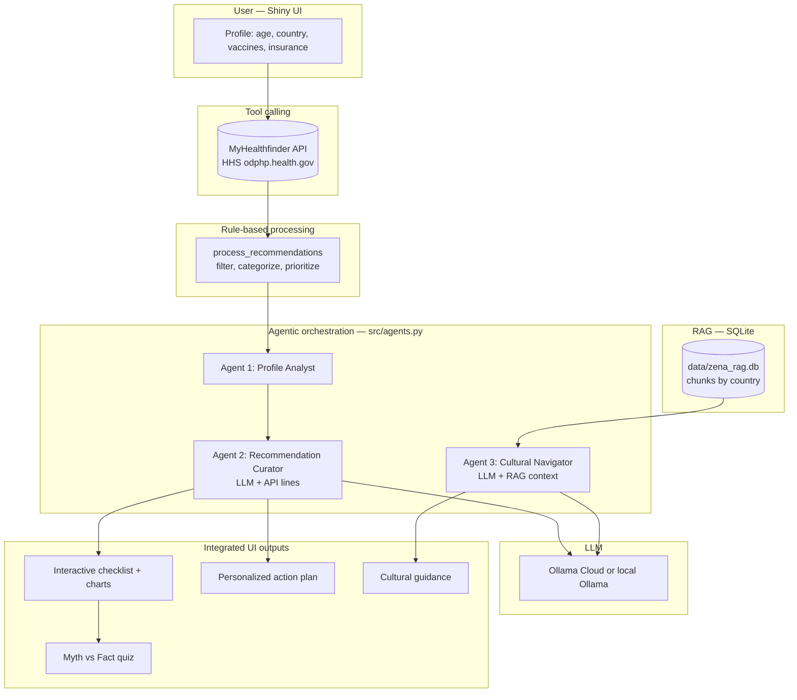

# Zena — App V2 Documentation (Course Submission)

Use this file as the **single source** for your **.docx** submission: copy sections below into Word, add your **live app URL**, **GitHub link**, and **team roster**.

---

## 1. Description (what the app does, APIs, new features, stakeholder value)

Zena is a **Shiny for Python** web application for **first-generation and international female students** who need clearer, culturally aware explanations of **preventive healthcare in the United States**. Many stakeholders grew up in systems where care is often **reactive** (see a clinician when sick). In the U.S., **preventive** care—screenings, vaccines, and well visits before symptoms—is common and often covered under the Affordable Care Act. That mismatch causes confusion about what is “normal,” what insurance covers, and what to do first on campus.

**External API:** Zena calls the **MyHealthfinder API** (U.S. Department of Health & Human Services). No API key is required. The app sends parameters such as age and sex and receives personalized **preventive care topics**, which are then **filtered and categorized** (e.g., Vaccinations, Screenings, Preventive Visits, Lifestyle & Mental Health) with **priority labels** (High, Routine, Informational).

**App V2 — Agentic orchestration:** After your profile is set and recommendations are loaded, Zena runs a **three-agent pipeline** implemented in `src/agents.py`: (1) **Profile Analyst** — structures your inputs and API metadata; (2) **Recommendation Curator** — turns official recommendation lines into a short **bullet action plan** using an **LLM** (Ollama Cloud or local Ollama), with safe fallbacks if the model is unavailable; (3) **Cultural Navigator** — explains how U.S. preventive norms may feel different from a student’s background, using **retrieved context** plus the LLM. Agent outputs appear directly in the UI as the **action plan** and **cultural guidance** blocks.

**App V2 — RAG:** Agent 3 uses **retrieval-augmented generation** over a **custom SQLite** knowledge base (`data/zena_rag.db`, table `chunks`). Snippets are selected by **country of origin** plus **general** U.S. system notes. The UI lists the **exact snippets** retrieved for transparency (assignment rubric: custom data source + search).

**App V2 — Tool calling:** The **Recommendation Curator** is grounded in **live tool output**: the app performs an **HTTP GET** to MyHealthfinder (see “Tool calling” panel in the app). Parameters and result counts are surfaced in the UI so instructors can verify **real API integration**, not static text.

**Stakeholder value:** Students get **actionable, plain-language** next steps tied to **trusted government** content, **readiness tracking** on a checklist, **cultural framing** to reduce shame or confusion, and a **Myth vs. Fact** quiz for literacy. Optional **password protection** supports private hosted demos without exposing the app to the open internet.

---

## 2. Process diagram (data flow: agents, RAG, tools)

Paste this diagram into Word (or export Mermaid to PNG using [mermaid.live](https://mermaid.live)):



---

## 3. Technical documentation

### 3.1 System architecture

| Component | Role |
|-----------|------|
| `app.py` | Shiny UI + server: sidebar profile, password gate (optional), results layout, matplotlib charts, transparency panels. |
| `src/api_client.py` | **Tool:** `fetch_myhealthfinder` — GET JSON from MyHealthfinder v4. |
| `src/data_processing.py` | Filters completed vaccines, assigns **category** and **priority**. |
| `src/rag.py` | **RAG:** `init_rag_db`, `retrieve_chunks_for_country` — SQLite semantic **filter** by country + General. |
| `src/ai_insights.py` | Ollama chat + caching helpers used by agents. |
| `src/agents.py` | **`orchestrate_health_plan`**: chains three agents; returns `pipeline_meta` (agent blurbs, tool table, RAG stats) and `rag_chunks` for the UI. |

### 3.2 Agent roles and coordination

1. **Profile Analyst** — Builds a structured `profile` dict (age, country, vaccines, insurance, recommendation count).  
2. **Recommendation Curator** — Consumes **MyHealthfinder-derived** lines; prompts the LLM to produce **3–6 bullets**; falls back to `personalized_summary` or static text if needed.  
3. **Cultural Navigator** — Retrieves **RAG chunks** for the user’s country; prompts the LLM for **2–4 paragraphs** comparing U.S. preventive norms without stereotyping.

### 3.3 RAG implementation

| Item | Detail |
|------|--------|
| **Source** | SQLite file `data/zena_rag.db`, table `chunks` (`country`, `content`). |
| **Search function** | `retrieve_chunks_for_country(country, limit=6)` — SQL `WHERE country = ? OR country = 'General'`, ordered with country-specific rows first. |
| **Use** | Concatenated text is injected into Agent 3’s system prompt; the app **lists each chunk** in the “Retrieved knowledge-base context” card. |

### 3.4 Tool calling implementation

| Function | Purpose | Parameters (typical) | Returns |
|----------|---------|----------------------|---------|
| `fetch_myhealthfinder` | Official preventive topics for the user’s demographic | `age`, `sex`, `pregnant`, `sexually_active`, `tobacco_use`, `lang` | JSON from HHS API or `None` on error |

The Shiny UI **Tool calling** panel shows the endpoint URL, parameters used for the session, and **how many recommendations** remained after filtering.

### 3.5 API keys, endpoints, packages

| Secret / config | Where |
|-----------------|--------|
| **MyHealthfinder** | No key — `https://odphp.health.gov/myhealthfinder/api/v4/myhealthfinder.json` |
| **Ollama** | `OLLAMA_API_KEY` (Cloud) or local `http://localhost:11434` — see `.env.example` |
| **Optional app password** | `ZENA_APP_PASSWORD` — gates sidebar until unlocked (for private deployment) |

**Python packages (see `requirements.txt`):** `shiny`, `pandas`, `requests`, `matplotlib`, `python-dotenv`, plus API/PCOS extras if you use other entrypoints.

**Repository layout (main app):** `app.py` (Zena), `src/*.py`, `data/zena_rag.db` (created on first run), `docs/` (this file).

### 3.6 Deployment platform

Deploy the **same** app entrypoint instructors use locally:

```bash
pip install -r requirements.txt
cp .env.example .env   # add Ollama / optional password
shiny run app.py
```

Hosted options: **shinyapps.io**, **Posit Connect**, **DigitalOcean** (Docker + Shiny Server). Step-by-step notes: [`docs/DEPLOYMENT.md`](DEPLOYMENT.md).

**Submission checklist:** In your .docx, include (1) **GitHub repository main page URL**, (2) **working live app URL**, (3) **password** if you set `ZENA_APP_PASSWORD`, (4) pointer to **this file** for long-form answers.

---

## 4. Usage instructions (for instructors / stakeholders)

1. Open the **deployed link** (or run locally with `shiny run app.py`).  
2. If the sidebar shows **Access**, enter the **team password** (submitted separately in Canvas).  
3. Enter **age**, **country**, **vaccines**, and **insurance**; click **Generate My Preventive Plan**.  
4. Review **analytics** (counts + charts), **multi-agent** descriptions, **MyHealthfinder** tool details, and **RAG snippets**.  
5. Use the **checklist** and **readiness score**; read the **action plan** and **cultural guidance**; try **Myth vs Fact**; **download CSV** if desired.  
6. Remember: **educational only**, not medical advice.

---

## 5. Team members by role (template)

| Name | Suggested role(s) |
|------|-------------------|
| _Name_ | e.g. Full stack / Agent orchestration |
| _Name_ | e.g. Frontend / UI |
| _Name_ | e.g. Backend / API & data pipeline |
| _Name_ | e.g. Prompt & LLM integration |
| _Name_ | e.g. DevOps / deployment |

_Everyone contributes as a developer; adjust labels to match your team._

---

## 6. Where answers live (for grading)

| Rubric item | Location |
|-------------|----------|
| Working app | **Your live URL** (and optional password in Canvas / .docx) |
| GitHub | **Repository main page URL** |
| Description & stakeholder value | **Section 1** above |
| Process diagram | **Section 2** (Mermaid → paste or export image) |
| Technical documentation | **Section 3** |
| Usage | **Section 4** |
| Team roster | **Section 5** |
